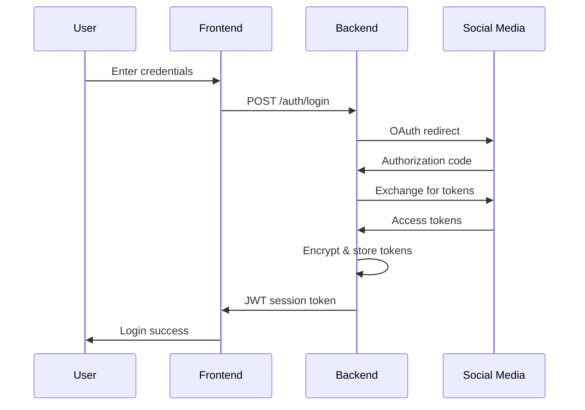
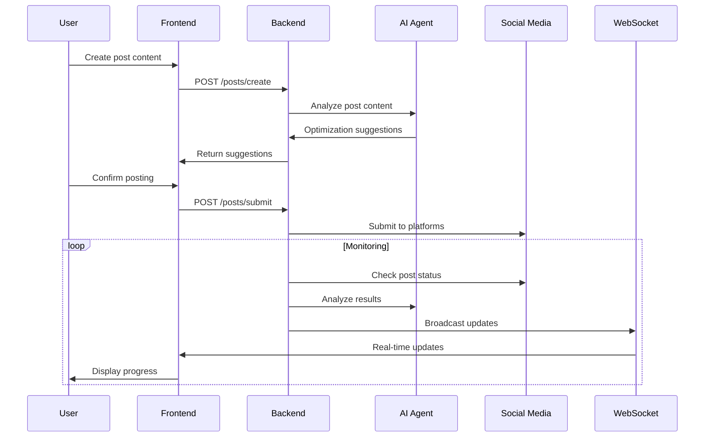
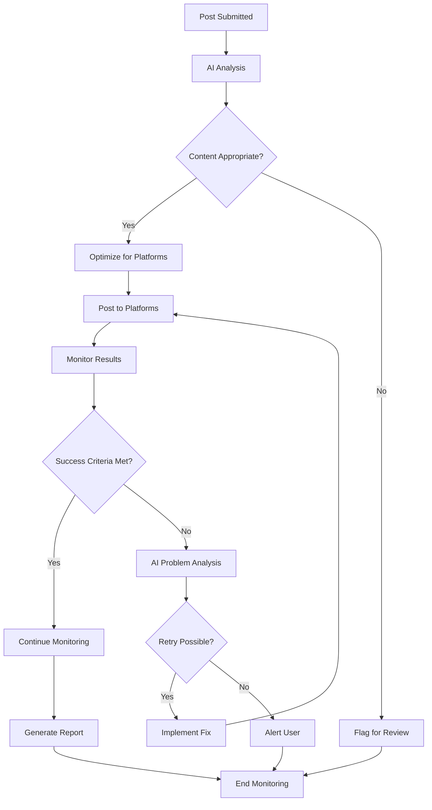

# System Architecture & Data Flow

## High-Level Architecture

```
┌─────────────────────────────────────────────────────────────────┐
│                         PostProber System                      │
├─────────────────────────────────────────────────────────────────┤
│                                                                 │
│  ┌─────────────┐    ┌─────────────┐    ┌─────────────────────┐  │
│  │  Frontend   │    │   Backend   │    │   External APIs     │  │
│  │  (React)    │◄──►│  (Node.js)  │◄──►│   & Automation      │  │
│  └─────────────┘    └─────────────┘    └─────────────────────┘  │
│         │                   │                       │          │
│         │                   │                       │          │
│  ┌─────────────┐    ┌─────────────┐    ┌─────────────────────┐  │
│  │  WebSocket  │◄──►│  Database   │    │    AI Agent         │  │
│  │  (Real-time)│    │  (SQLite)   │    │   (OpenAI)          │  │
│  └─────────────┘    └─────────────┘    └─────────────────────┘  │
│                                                                 │
└─────────────────────────────────────────────────────────────────┘
```

## Component Architecture

### Frontend Components
```
src/frontend/
├── App.jsx                 # Main application component
├── components/
│   ├── auth/
│   │   ├── LoginForm.jsx      # User authentication
│   │   └── AccountManager.jsx # Social media account linking
│   ├── composer/
│   │   ├── PostComposer.jsx   # Post creation interface
│   │   └── PlatformSelector.jsx # Choose posting platforms
│   ├── monitoring/
│   │   ├── Dashboard.jsx      # Real-time monitoring view
│   │   ├── StepProgress.jsx   # Step-by-step progress
│   │   └── AlertPanel.jsx     # Error/success notifications
│   └── common/
│       ├── Header.jsx         # Navigation
│       └── Sidebar.jsx        # Menu navigation
├── hooks/
│   ├── useAuth.js            # Authentication state
│   ├── useRealTime.js        # WebSocket connection
│   └── useMonitoring.js      # Monitoring data
└── utils/
    ├── api.js                # API client
    └── constants.js          # App constants
```

### Backend Services
```
src/backend/
├── server.js               # Express server entry point
├── routes/
│   ├── auth.js               # Authentication endpoints
│   ├── posts.js              # Post management
│   ├── accounts.js           # Social media accounts
│   └── monitoring.js         # Monitoring data
├── controllers/
│   ├── AuthController.js     # Auth business logic
│   ├── PostController.js     # Post operations
│   └── MonitorController.js  # Monitoring logic
├── services/
│   ├── platforms/
│   │   ├── TwitterService.js   # Twitter API integration
│   │   ├── LinkedInService.js  # LinkedIn API integration
│   │   └── InstagramService.js # Instagram automation
│   ├── AIAgentService.js       # OpenAI integration
│   ├── MonitoringService.js    # Monitoring orchestration
│   └── NotificationService.js  # Alert system
├── models/
│   ├── User.js               # User data model
│   ├── Account.js            # Social media accounts
│   ├── Post.js               # Post records
│   └── MonitoringLog.js      # Monitoring history
└── middleware/
    ├── auth.js               # JWT authentication
    ├── validation.js         # Input validation
    └── logging.js            # Request logging
```

## Data Flow Diagrams

### User Authentication Flow


### Post Creation & Monitoring Flow


### AI Agent Decision Flow


## Database Schema

### Core Tables
```sql
-- Users table
CREATE TABLE users (
    id INTEGER PRIMARY KEY AUTOINCREMENT,
    email VARCHAR(255) UNIQUE NOT NULL,
    password_hash VARCHAR(255) NOT NULL,
    created_at DATETIME DEFAULT CURRENT_TIMESTAMP,
    updated_at DATETIME DEFAULT CURRENT_TIMESTAMP
);

-- Social media accounts
CREATE TABLE accounts (
    id INTEGER PRIMARY KEY AUTOINCREMENT,
    user_id INTEGER REFERENCES users(id),
    platform VARCHAR(50) NOT NULL, -- 'twitter', 'linkedin', 'instagram'
    account_name VARCHAR(255),
    access_token TEXT, -- encrypted
    refresh_token TEXT, -- encrypted
    token_expires_at DATETIME,
    is_active BOOLEAN DEFAULT true,
    created_at DATETIME DEFAULT CURRENT_TIMESTAMP
);

-- Posts
CREATE TABLE posts (
    id INTEGER PRIMARY KEY AUTOINCREMENT,
    user_id INTEGER REFERENCES users(id),
    content TEXT NOT NULL,
    platforms JSON, -- ['twitter', 'linkedin']
    status VARCHAR(50) DEFAULT 'draft', -- 'draft', 'posting', 'posted', 'failed'
    ai_suggestions JSON,
    created_at DATETIME DEFAULT CURRENT_TIMESTAMP,
    posted_at DATETIME
);

-- Monitoring logs
CREATE TABLE monitoring_logs (
    id INTEGER PRIMARY KEY AUTOINCREMENT,
    post_id INTEGER REFERENCES posts(id),
    platform VARCHAR(50),
    step VARCHAR(100), -- 'authentication', 'posting', 'verification', 'engagement'
    status VARCHAR(50), -- 'pending', 'success', 'failed', 'warning'
    details JSON,
    ai_analysis TEXT,
    timestamp DATETIME DEFAULT CURRENT_TIMESTAMP
);

-- Alerts
CREATE TABLE alerts (
    id INTEGER PRIMARY KEY AUTOINCREMENT,
    user_id INTEGER REFERENCES users(id),
    post_id INTEGER REFERENCES posts(id),
    type VARCHAR(50), -- 'error', 'warning', 'success'
    message TEXT,
    is_read BOOLEAN DEFAULT false,
    created_at DATETIME DEFAULT CURRENT_TIMESTAMP
);
```

## API Endpoint Structure

### Authentication Endpoints
```javascript
POST   /api/auth/login          # User login
POST   /api/auth/logout         # User logout
GET    /api/auth/me             # Get current user
POST   /api/auth/refresh        # Refresh JWT token
```

### Account Management
```javascript
GET    /api/accounts            # List connected accounts
POST   /api/accounts/connect    # Connect new social media account
DELETE /api/accounts/:id        # Disconnect account
PUT    /api/accounts/:id        # Update account settings
```

### Post Management
```javascript
GET    /api/posts               # List user posts
POST   /api/posts               # Create new post
GET    /api/posts/:id           # Get specific post
PUT    /api/posts/:id           # Update post
DELETE /api/posts/:id           # Delete post
POST   /api/posts/:id/submit    # Submit post for publishing
```

### Monitoring
```javascript
GET    /api/monitoring/:postId  # Get monitoring status
GET    /api/monitoring/:postId/logs # Get detailed logs
POST   /api/monitoring/:postId/retry # Retry failed operations
```

### WebSocket Events
```javascript
// Client to Server
'join_monitoring'     # Join monitoring room for specific post
'leave_monitoring'    # Leave monitoring room

// Server to Client
'monitoring_update'   # Real-time monitoring updates
'alert_notification'  # New alert for user
'post_status_change'  # Post status changed
```

## Security Architecture

### Authentication & Authorization
```
┌─────────────┐    ┌─────────────┐    ┌─────────────┐
│   Client    │    │   Server    │    │  Database   │
├─────────────┤    ├─────────────┤    ├─────────────┤
│ JWT Token   │◄──►│ Verify JWT  │◄──►│ User Data   │
│ (Headers)   │    │ Middleware  │    │ (Encrypted) │
└─────────────┘    └─────────────┘    └─────────────┘
```

### Data Encryption
- **At Rest**: Social media tokens encrypted with AES-256
- **In Transit**: HTTPS/WSS for all communications
- **Secrets**: Environment variables for API keys

## Scalability Considerations

### Current Architecture Limits
- **Concurrent Users**: ~100 (single server)
- **Posts per Hour**: ~1000 (API rate limits)
- **Real-time Connections**: ~500 WebSocket connections

### Scaling Strategy
1. **Horizontal Scaling**: Load balancer + multiple Node.js instances
2. **Database**: Migrate SQLite → PostgreSQL with connection pooling
3. **Caching**: Redis for session storage and API rate limit tracking
4. **Queue System**: Bull/BullMQ for background job processing

This architecture balances simplicity for demonstration with production-ready patterns that can scale as needed.