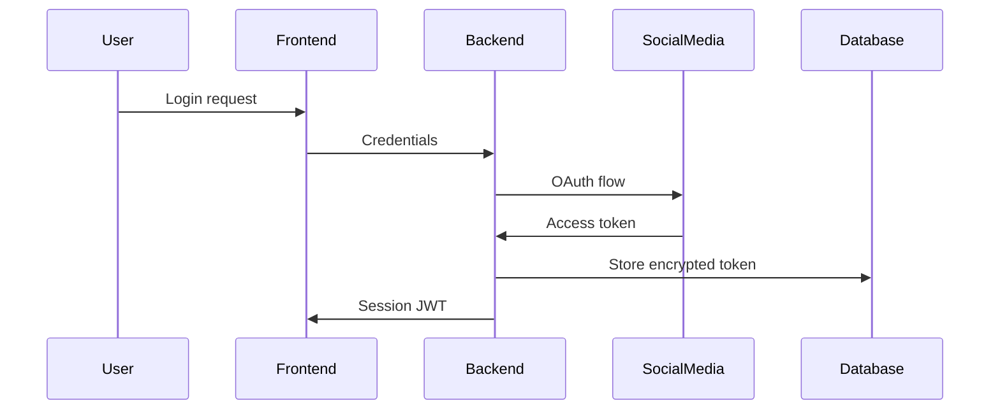

# Technology Stack Analysis

## Framework Comparison Matrix

| Technology | Pros | Cons | Complexity | Best For |
|------------|------|------|------------|----------|
| **React + Node.js** ✅ | Single language, rich ecosystem, fast development | JavaScript quirks, callback complexity | Low | Full-stack prototypes |
| Python + FastAPI | Type safety, mature AI libraries | Two languages, slower frontend | Medium | AI-heavy backends |
| Vue + Express | Gentle learning curve, good performance | Smaller ecosystem | Low | Small teams |
| Angular + NestJS | Enterprise patterns, strong typing | Steep learning curve, verbose | High | Large applications |

## Database Options Analysis

| Database | Setup Complexity | Scalability | ACID Support | Best For |
|----------|------------------|-------------|--------------|----------|
| **SQLite** ✅ | Minimal (file-based) | Limited | Yes | Development/demos |
| PostgreSQL | Medium (server setup) | Excellent | Yes | Production |
| MongoDB | Medium (server setup) | Good | Limited | Document storage |
| DynamoDB | Low (managed) | Excellent | Limited | AWS ecosystem |

## AI Integration Options

| Service | Cost | Capabilities | Integration | Latency |
|---------|------|-------------|-------------|---------|
| **OpenAI API** ✅ | Pay-per-use | Advanced reasoning, text generation | Simple REST API | ~1-2s |
| Local LLM (Ollama) | Infrastructure cost | Basic reasoning | Complex setup | ~5-10s |
| Claude API | Pay-per-use | Advanced reasoning, good at code | Simple REST API | ~1-2s |
| Google PaLM | Pay-per-use | Good performance | More complex auth | ~2-3s |

## Social Media API Landscape

### Platform API Availability
- **Twitter/X**: ✅ API available (paid tiers)
- **LinkedIn**: ✅ Limited API for posts
- **Instagram**: ❌ Very limited API, requires Business accounts
- **Facebook**: ✅ Graph API available

### Automation Strategy
```javascript
// API-First Approach (preferred)
if (platform.hasOfficialAPI) {
  return useOfficialAPI(platform, credentials);
}

// Browser Automation Fallback
return usePuppeteerAutomation(platform, loginCredentials);
```

## Infrastructure Decisions

### Why Single-Language Stack?
```bash
# Context switching cost
Developer Time: Python Backend → JavaScript Frontend
              ↓
            +30% cognitive overhead
            +20% debugging time
            +40% deployment complexity
```

### Why SQLite for Demo?
```sql
-- Setup complexity comparison
PostgreSQL: brew install postgresql → createdb → connection config
SQLite:     npm install sqlite3 → done
```

### Why Puppeteer over Selenium?
```javascript
// Resource usage comparison
Selenium WebDriver: 150MB+ memory, Java/Python bridge overhead
Puppeteer:         80MB memory, direct Chrome DevTools Protocol
```

## Deployment Strategy

### Development
```bash
npm run dev  # Starts both frontend and backend
```

### Production Options
1. **Docker Compose** (recommended for demo)
2. **Vercel + Railway** (easiest cloud deployment)
3. **AWS ECS** (enterprise option)

## Risk Assessment

| Risk | Probability | Impact | Mitigation |
|------|-------------|--------|------------|
| API Rate Limits | High | Medium | Implement queue system, user warnings |
| Platform API Changes | Medium | High | Use wrapper services, fallback automation |
| Browser Detection | Medium | Medium | Rotate user agents, human-like delays |
| Authentication Issues | High | High | OAuth refresh tokens, clear error messages |

## Performance Considerations

### Expected Load
- **Users**: 10-100 concurrent (demo scale)
- **Posts**: 1-10 per user per day
- **Monitoring**: Real-time updates every 5-30 seconds

### Bottlenecks
1. **Social Media APIs**: Rate limited (15-300 requests/15min)
2. **Browser Automation**: CPU intensive (1-2 concurrent instances)
3. **AI Processing**: Network latency dependent (1-3s per call)

### Optimization Strategy
```javascript
// Queue system for rate limit management
const postQueue = new Queue('social-media-posts', {
  concurrency: 1,
  interval: 60000 / 15  // 15 requests per minute
});
```

## Security Considerations

### Data Protection
- **User Credentials**: Encrypted storage, never logged
- **API Keys**: Environment variables, rotation capability
- **Session Management**: JWT with short expiry
- **HTTPS**: Required for all external communications

### Authentication Flow


This tech stack maximizes development speed while maintaining production-ready patterns and clear upgrade paths.